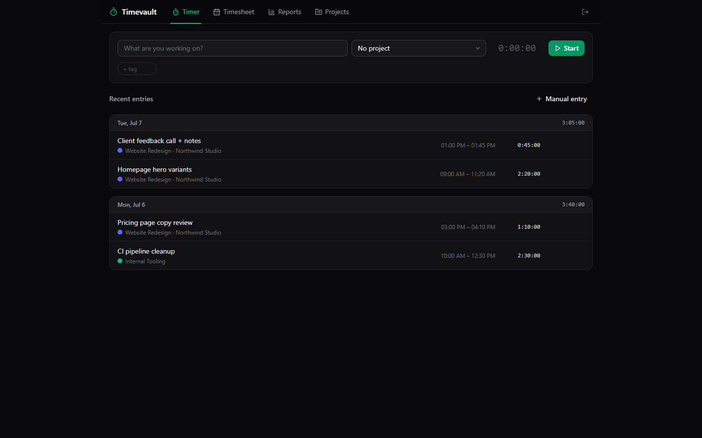

# ⏱️ Timevault

[](LICENSE)

**Self-hosted time tracking for freelancers who bill clients.** One-click timers, projects with hourly rates, weekly timesheets, and reports that compute exactly what to invoice — running on *your* machine or *your* $5 VPS.

**Pay once. Own it forever. No subscription.** Toggl charges $10/user/month, forever. Timevault is yours.



## Features

- **One-click timer** — description, project, tags; start with Enter. The timer is **server state**: reload the page, close the tab, restart your browser — it keeps counting.
- **Stop / discard / continue** — stop to save, discard mistakes, or one-click continue any previous entry.
- **Manual entries** — enter start + end times, or start + duration ("1:30", "1.5", "90m").
- **Projects, clients & rates** — projects with colors, clients, billable flag and an hourly rate. Archive finished projects without losing history.
- **Tags** — create on the fly, filter reports by them.
- **Weekly timesheet** — 7-day grid, inline-edit descriptions and durations right in the cell.
- **Reports** — pick a range, group by project / client / tag / day. Bar chart of hours per day, donut of the split, exact total + billable amounts computed from your rates.
- **Entry rounding** — round to nearest 5 or 15 minutes *at report level* (your raw data is never touched) — bill like a law firm.
- **Overlap detection** — double-booked entries get a warning badge so your invoices survive scrutiny.
- **CSV export + printable summary** — hand your client a clean statement.
- **100% local & private** — SQLite file, no telemetry, no cloud, no account.

## Quick start

```bash
npm i
npm run build
npm start        # → http://localhost:5316  (password: admin)
```

### Run it as a desktop app…

```bash
npm run desktop
```

A tray-friendly window opens, auto-logged-in, with its own local database (Electron userData). Same code, zero setup.

### …or deploy to a $5 VPS when you need it public

```bash
cp .env.example .env   # set ADMIN_PASSWORD!
docker compose up -d   # → port 5316, data persisted in a named volume
```

## Tech stack

- **Server** — Node 20+, Express, better-sqlite3 (WAL). Single process serves the API and the built frontend.
- **Frontend** — React 18 + Vite, Tailwind CSS 4, Lucide icons, Framer Motion. Hand-rolled SVG charts (no chart lib).
- **Desktop** — thin Electron wrapper that boots the same Express server on a free local port.

## Timevault vs Toggl

| | **Timevault** | Toggl Starter |
|---|---|---|
| Price | **$29 once** | $10/user/**month** |
| Cost over 3 years | **$29** | $360 |
| Your data lives | **Your server / your PC** | Their cloud |
| Billable rates & totals | ✅ | ✅ |
| Timesheet week view | ✅ | ✅ |
| Report rounding (5/15 min) | ✅ | ✅ (paid tier) |
| CSV export | ✅ | ✅ |
| Overlap detection | ✅ | ❌ |
| Works offline | ✅ | ❌ |
| Open source | ✅ MIT | ❌ |

## ☕ Skip the setup — get the 1-click installer

Don't want to touch a terminal? Grab the packaged installer (Windows) with everything pre-built:

**→ [https://whop.com/onetime-suite](https://whop.com/onetime-suite)**

## Development

```bash
npm start          # API on :5316
npm run dev        # Vite dev server on :5317 (proxies /api)
npm test           # end-to-end smoke test against a temp DB
```

## License

MIT © 2026 Ben ([bensblueprints](https://github.com/bensblueprints))
